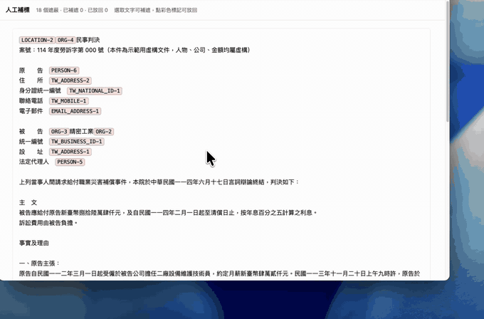
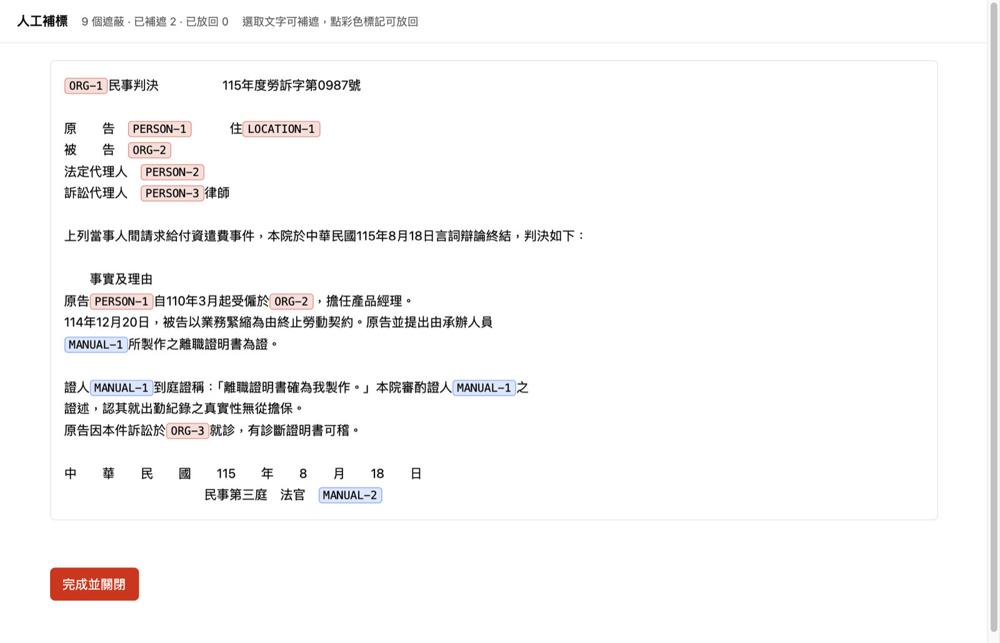

# pii-guard

繁體中文（台灣）個人資料去識別化工具。把文件裡的個資換成可還原的代號，讓你能用雲端 AI 處理機敏文件，處理完再換回來。**偵測與還原全程在你自己的機器上跑。**

---

**English summary** — Reversible PII de-identification for Traditional Chinese (Taiwan) documents.

Most tools that strip PII before an LLM call are network gateways ([LiteLLM + Presidio](https://www.litellm.ai/), [PrivAiTe](https://github.com/crp4222/PrivAiTe), [AI Security Gateway](https://github.com/aisecuritygateway/aisecuritygateway)) and they work well. None of them handle Taiwanese PII: national ID and ARC numbers, 統一編號 business IDs, local phone formats, or Traditional Chinese personal and organisation names — which need CKIP's Chinese NER rather than an English model with the locale switched.

This fills that gap, and differs in one more way: it produces a **redacted file you can keep and hand to someone**, not a per-request proxy. Detection is Presidio + CKIP BERT + Taiwan regex; substitution and restoration are plain code, so restoration is exact. A bundled Claude Code skill runs the whole thing without letting the cloud agent read the original.

Everything below is in Traditional Chinese. Start at [安裝](#安裝).

---

## 為什麼還要一個？

處理「送進 LLM 之前先遮個資」的工具已經很多，而且做得好——但它們幾乎都是**網路層的 gateway**，攔在你的程式和模型供應商之間。

它們沒有處理的是**台灣的個資**：身分證與居留證字號、統一編號、本地電話格式，以及繁體中文的人名與組織名——後者需要中研院的 CKIP 中文 NER，不是英文模型換個語系就行。

這個專案補的是那一塊。另外還差一件事：**它產出的是一份你可以留存、可以交給別人的檔案**，不是逐次請求、用完即逝的代理。

## 實際輸出

下面是真的跑出來的，不是示意圖。輸入：

```
客戶：王小明
聯絡電話：0912345678
電子郵件：wang@example.com
身分證字號：A123456789
所屬公司：範例科技股份有限公司（統一編號 10000009）
通訊地址：臺北市中正區忠孝東路一段
案由：本季顧問合約續約，金額新臺幣 30 萬元，付款分兩期。
```

`uv run python -m pii_guard anonymize input.txt -o out.txt -m map.json` 之後：

```
客戶：<PERSON_1>
聯絡電話：<TW_MOBILE_1>
電子郵件：<EMAIL_ADDRESS_1>
身分證字號：<TW_NATIONAL_ID_1>
所屬公司：<ORG_1>（統一編號 <TW_BUSINESS_ID_1>）
通訊地址：<LOCATION_1>
案由：本季顧問合約續約，金額新臺幣 30 萬元，付款分兩期。
```

七項個資全部換成代號，**而金額、合約條款、日期原封不動**。這是刻意的——把那些也拿掉，文件就沒有送進 AI 的意義了。

對照表另存一份，AI 回答完之後用它換回真名，逐字精確。

## 人工補標介面

偵測層是機率性的，會有漏網，也會把不該遮的機構名遮掉。skill 因此提供一個在**你自己的瀏覽器**開的頁面：選取任何仍然裸露的文字就補遮（全文所有出現位置一起遮），點任何代號就看到背後的真實值，決定要不要放回。



上面這段是實際操作（示範用的判決書為虛構文件）。開頭那份判決書連「臺灣士林地方法院」都被切成兩個代號，看不出是哪個法院判的；點下去看到真實值，決定放回。醫院名更能說明偵測層的性質——同一家醫院在同一份文件裡，一處被整個吃掉、另一處只吃掉前兩個字，前後判成不同類別。最後圈選補遮漏網的公司名，全文所有出現位置一起遮。



靜態圖裡藍色的 `MANUAL-1` 是使用者補遮的證人姓名——他只圈了一處，三處同時變成同一個代號。`MANUAL-2` 是補遮的法官。紅色那些是偵測層自動抓到的，其中 `ORG-1`、`ORG-3` 是法院與醫院，點下去可以放回原文，判決書才讀得下去。

**這一頁呼叫端連不上**：網址帶一次性 token，在私有子行程內產生、只交給它自己開的瀏覽器，從不印出；回執只有數量，沒有網址。

## 這不是什麼

想要「所有雲端請求自動遮蔽、不用逐份處理、可批量」——**你要的是 gateway，不是這個**，請去用 [LiteLLM + Presidio](https://www.litellm.ai/) 或 [PrivAiTe](https://github.com/crp4222/PrivAiTe)。它們做得比較好，我不打算重做一次。

這個專案適合的是：**單份重要文件，你要一份可留存的去識別化版本，而且文件是繁體中文的。**

它也**不是機密分級工具**。它遮的是「能指認到特定個人」的資訊。金額、病情、行程、合約條款只要不指向個人就會留著。不要單憑它宣稱「整份文件可以對外」。

## 還在做的事

商用 agent 的越權跟隔離問題我還在研究，未來考慮走 proxy 配置。批量文檔處理與多格式文檔處理也是接下來努力的方向。

歡迎有興趣協作者一起試用，也歡迎所有的提意見跟 PR。

## 安裝

需要 Python 3.13（3.11 以上可跑）、[uv](https://docs.astral.sh/uv/)、以及 [Ollama](https://ollama.com/)（只有 skill 的稽核層需要）。

```bash
git clone https://github.com/danyuchn/pii-guard.git
cd pii-guard
uv sync

# 需要 CLI 直接處理 .docx / .xlsx / .pdf 時再加裝
uv sync --extra formats
```

首次執行會下載 CKIP BERT NER 模型（約 500MB）。未加裝 `formats` 時，`tests/test_file_handlers.py` 的 10 個測試會因缺少套件而跳不過，屬預期行為。

## Claude Code Skill

本 repo 內含 `pii-safe-documents` skill，位於 `.agents/skills/pii-safe-documents/`。它在 CLI 之外做兩件事：

- **不讓主 agent 讀到原始文件、對照表與還原結果**——讀檔、呼叫模型、還原都在獨立的本地行程裡完成，主 agent 只拿到路徑與回執。
- **在決定性偵測之後加一層本地模型稽核**，補偵測層抓不到的漏網（真實判決書的簽名欄人名就是這一類）。

安裝方式是連結進 skills 目錄，不要複製：

```bash
ln -s "$(pwd)/.agents/skills/pii-safe-documents" ~/.claude/skills/pii-safe-documents
ollama pull ornith-1.5:9b
```

用連結而非複製，是因為 skill 需要找到它所屬的 repo 才能呼叫 pii-guard 本體。只能複製的環境改設 `PII_GUARD_HOME` 指向 clone 出來的路徑。

### 三個步驟

```bash
S=.agents/skills/pii-safe-documents/scripts/pii_safe_workflow.py

# 1. 產生去識別化副本
python3 $S redact --input "/絕對路徑/機密文件.txt"

# 2. 人工補標（在你自己的瀏覽器開一頁）
python3 $S annotate --job-id "<job_id>"

# 3. 編輯完成後還原
python3 $S restore --job-id "<job_id>" --input "編輯後的.txt" --output "還原.txt"
```

第 2 步就是上面[人工補標介面](#人工補標介面)那一頁。每次編輯都即時落檔並重新驗證整份仍能逐字還原，所以中途關掉分頁只會失去還沒做的編輯。

在 Claude Code 裡直接說「幫我把這份檔案去識別化」也可以，skill 會照這個流程走。

### 進階／無瀏覽器環境

`mask --terms <詞清單檔>`、`unmask --marker TYPE-N` 是同樣兩種操作的指令列版本，`review` 列出代號與真實值。`review` 會印出未遮蔽的內容，因此在輸出不是終端機時拒絕執行。`purge` 刪除一個工作目錄。

## 準確率

**可重現的部分**：`tests/eval/eval_corpus.json` 是 53 條合成標註語料，已在版控中，任何人都能跑：

```bash
uv run pytest tests/eval -m eval
```

**不可重現的部分**：另有兩批真實台灣文件（判決書、監察院個案、政府新聞稿、新聞、通訊錄、裁罰表）共 17 份、71 個手工標註檢查項，在最終版程式碼下全數通過、零洩漏。第二批十份是修完之後才取得、過程中從未用來調校，那批才有驗收意義。

**這批數字你無法驗證，因為語料含真實姓名、永遠不會進 git。** 請據此打折。

還有一件必須講的：**合成語料會系統性高估**。原本的合成測試四個模型三個滿分，換成真實判決書後同一批模型立刻現形——9B 把十個人壓成同一個代號。所以上面那 53 條的分數，不要當成真實文件上的表現。

## 威脅模型

這是**防止意外把原文餵給雲端模型的強保護，不是作業系統層級的安全邊界**。

skill 的隔離做的是：原文與對照表從不經過主 agent 的輸出通道，函式庫的警告訊息（會回吐原文）被丟棄，錯誤只以代碼回報，失敗的工作目錄直接刪除。這些擋掉的是每次都會發生的**意外曝光**。

它擋不住的是：主 agent 與那些檔案是**同一個使用者身分**，`cat` 得到就是 `cat` 得到。檔案權限 0600 對擁有者不設防。真正的敵意隔離需要另一個系統帳號或獨立權限的本地 broker，這個 repo 沒有做，也不該假裝有做。

**如果你的主 agent 本來就是本地模型**（Claude Code 可以指向 Ollama），那上面整段都不適用——原文哪裡都沒去。反過來說，這個專案存在的意義，正是讓你**用雲端模型的能力、同時不把個資交出去**。

## 架構

```
原始文件
    ↓
[偵測層] CKIP BERT NER + 台灣 Regex           ← 機率性，會漏
    ↓  （skill 另加：本地模型稽核，多次取樣取聯集）
    ↓  （skill 另加：人工補標介面）
[替換層] 程式碼建立對照表                       ← 決定性
    ↓
去識別化文本 → 送 LLM → AI 回答（含代號）
    ↓
[還原層] 程式碼反向替換                         ← 決定性，逐字精確
```

**關鍵設計原則**：偵測層可以是機率性的，但**替換與還原全部由程式碼完成**，所以還原一定精確。

| 層次 | 工具 |
|------|------|
| PII 框架 | [Microsoft Presidio](https://github.com/microsoft/presidio)（MIT） |
| 繁中 NER | [ckiplab/bert-base-chinese-ner](https://huggingface.co/ckiplab/bert-base-chinese-ner)（中研院，102M） |
| 台灣 PII Regex | 自建 PatternRecognizer |
| 本地稽核模型 | Ollama（預設 `ornith-1.5:9b`） |
| 語言／套件管理 | Python 3.13 / uv |

**支援的 PII 類型**：人名、組織、地名（CKIP）；身分證、外籍居留證、護照、統一編號、手機、市話、車牌、出生日期、銀行帳號（Regex）；Email、信用卡號（Presidio 內建）。

**輸入限制**：skill 目前只吃 64 KiB 以內的 UTF-8 純文字（`.txt` `.md` `.csv` `.tsv` `.log` `.dat`）。CLI 加裝 `formats` 後可讀 `.docx` `.xlsx` `.pdf`。

## 速度

skill 的稽核層開啟推理並對每個視窗取樣三次，**單份文件實測 10–50 分鐘**。這是為了召回率付的代價——關閉推理時，模型會漏掉判決書簽名欄的書記官姓名。

**批量處理上百份文件在此設定下不可行。** 需要批量請看上面「這不是什麼」。

## 路線圖

- [x] Presidio + CKIP NER + 台灣 Regex，MCP server 介面
- [x] 評估語料與 precision/recall 框架
- [x] `pii-safe-documents` skill（主 agent 隔離的可逆去識別化）
- [x] 人工補標介面（localhost 網頁）
- [ ] **效能**：先用決定性規則篩出可疑段落再送模型，讓批量可行
- [ ] **更多文件類型**：library 端已能讀 docx/xlsx/pdf，卡在 skill 端——解析套件可能在警告訊息中回吐原文，需移進私有行程並驗證
- [ ] **可公開的準確率**：需另建一份可公開語料才能報真實文件上的數字
- [ ] **工作目錄保留期限**：`~/.local/share/pii-safe-documents/jobs/` 目前只有手動 `purge`，沒有自動清理。長期使用會累積大量含真實對照表的目錄。
- [ ] **CI**

### 已知問題

- 尚未實作簡繁折疊：稽核模型若回傳簡體姓名會以 `LOCAL_AUDIT_UNRESOLVED` 失敗。
- Presidio 把法院、醫院、公司名判為組織而遮蔽，判決書因此失去部分文件用途。短期用 `--allow` 逐案放行，或用補標介面放回。
- 曾出現一次 `ROUNDTRIP_INTEGRITY_FAILED`，其後未再重現，未能隔離。

### 已退役

**`--llm-fallback` 與 `OllamaRecognizer`**（2026-08-21 移除）。它與 skill 的稽核層目的重疊，但沒有任何語料證明它有效，並存只會讓人選錯。要在 CLI 端補回模型稽核，正確做法是下沉 skill 那一套，不是重新啟用這個。

**Claude Code PreToolUse hook**（移至 [`examples/claude-code-hook/`](examples/claude-code-hook/)）。早期做法是攔截讀檔並自動遮蔽，已被 skill 的顯式流程取代。留著是因為它示範了另一種整合思路，但**不再維護**。

## 作者

[Dustin Yuchen Teng（鄧宇辰）](https://github.com/danyuchn)——AI 導入顧問與課程講師，在做的事情是把 coding agent 變成實際可用的工作流程。這個專案是其中一條線的產物。

## 變更紀錄

見 [CHANGELOG.md](CHANGELOG.md)。

## 授權

MIT。見 [LICENSE](LICENSE)。
